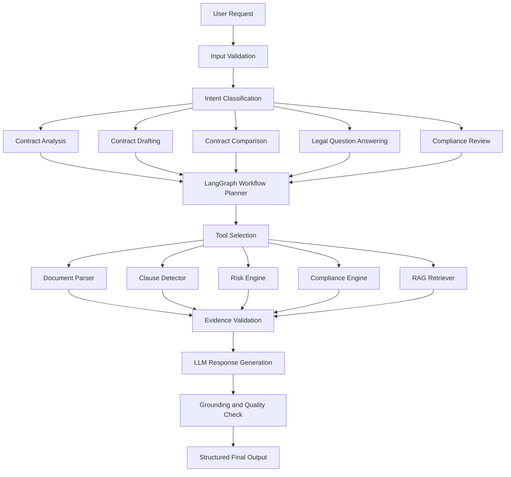

<div align="center">


</div>

---

<div align="center">


</div>

---

# LexForge AI v5.0

## Enterprise Contract Intelligence Platform

LexForge AI is an enterprise-grade, AI-powered contract intelligence platform for analyzing, reviewing, comparing, drafting, searching, and managing legal agreements.

The platform combines deterministic contract analysis, Generative AI, Retrieval-Augmented Generation, vector search, and LangGraph-based agent workflows to produce structured, explainable, and evidence-grounded legal insights.

It is designed for legal teams, procurement departments, compliance professionals, contract managers, business teams, and enterprise administrators.

> **Disclaimer:** LexForge AI assists with contract review and document intelligence. It does not replace qualified legal professionals or constitute legal advice.

---

# Key Features

* AI contract analysis
* AI contract drafting
* Contract comparison
* Legal document chatbot
* LangGraph agent workflow
* Hybrid Retrieval-Augmented Generation
* Evidence-grounded answers
* Clause classification
* Risk and compliance analysis
* Obligation extraction
* Deadline and renewal detection
* Named entity recognition
* Executive summary generation
* Negotiation recommendations
* Interactive dashboards
* Contract CRUD management
* Authentication and role-based access
* ChromaDB and Pinecone support

---

# Demo

<p align="center">


</p>

> Add your `demo.gif` file to the repository root or update the path above.

---

# System Architecture

```text
                       ┌──────────────────────────┐
                       │      User Interface      │
                       │   Streamlit Dashboard    │
                       └────────────┬─────────────┘
                                    │
                                    ▼
                       ┌──────────────────────────┐
                       │ Authentication and RBAC  │
                       └────────────┬─────────────┘
                                    │
                                    ▼
                       ┌──────────────────────────┐
                       │ Document Upload Gateway  │
                       └────────────┬─────────────┘
                                    │
                                    ▼
                 ┌────────────────────────────────────┐
                 │ Document Intelligence Pipeline     │
                 │ PDF | DOCX | TXT | OCR | Images    │
                 └──────────────────┬─────────────────┘
                                    │
                 ┌──────────────────┴──────────────────┐
                 │                                     │
                 ▼                                     ▼
      ┌────────────────────────┐            ┌────────────────────────┐
      │ Deterministic Analyzer │            │ LangGraph AI Workflow  │
      │ Rules and Legal Checks │            │ Planning and Tool Use  │
      └────────────┬───────────┘            └────────────┬───────────┘
                   │                                     │
                   ▼                                     ▼
      ┌────────────────────────┐            ┌────────────────────────┐
      │ Metadata, Clauses and  │            │ Hybrid RAG Retrieval   │
      │ Obligations Extraction │            │ Search and Re-ranking  │
      └────────────┬───────────┘            └────────────┬───────────┘
                   │                                     │
                   └──────────────────┬──────────────────┘
                                      ▼
                         ┌─────────────────────────┐
                         │ Evidence Grounding      │
                         │ Citations and Validation│
                         └────────────┬────────────┘
                                      │
                                      ▼
                         ┌─────────────────────────┐
                         │ Risk, Compliance and    │
                         │ Executive Intelligence  │
                         └────────────┬────────────┘
                                      │
                                      ▼
                         ┌─────────────────────────┐
                         │ Dashboard and Reports   │
                         └─────────────────────────┘
```

---

# Core Modules

## Contract Analyzer

The analyzer can perform:

* Contract type classification
* Party and organization extraction
* Effective and expiration date extraction
* Payment term identification
* Clause detection and classification
* Obligation extraction
* Deadline detection
* Renewal condition detection
* Liability analysis
* Indemnification analysis
* Confidentiality review
* Governing law extraction
* Dispute resolution detection
* Intellectual property review
* Data protection analysis
* Risk scoring
* Compliance checking
* Executive summarization
* Negotiation recommendation generation

---

## Contract Writer

LexForge AI can generate:

* Non-Disclosure Agreements
* Vendor Agreements
* Supply Agreements
* Employment Agreements
* Service Agreements
* SaaS Agreements
* License Agreements
* Partnership Agreements
* Purchase Agreements
* Consulting Agreements
* Distribution Agreements
* Data Processing Agreements
* Master Service Agreements
* Memoranda of Understanding
* Custom Agreements

The writer can use party details, pricing, payment terms, delivery conditions, warranties, liabilities, confidentiality requirements, termination rights, governing law, and custom instructions.

---

## Legal Assistant

The document-grounded chatbot can answer questions such as:

* What are the payment terms?
* Who are the contracting parties?
* What is the contract duration?
* Is an indemnification clause present?
* What are the termination rights?
* Is liability capped?
* Which deadlines are mentioned?
* Does the agreement renew automatically?
* Which clauses are missing?
* What are the main negotiation risks?
* Which source clause supports the answer?

Responses can include:

* Direct answer
* Relevant contract clause
* Document name
* Page or section reference
* Risk explanation
* Confidence information
* Recommended action

---

## Contract Comparison

The comparison engine can identify:

* Added and removed clauses
* Modified wording
* Changed dates
* Changed payment amounts
* Changed notice periods
* Changed obligations
* Changed liability terms
* Changed termination rights
* Changed renewal conditions
* Changed governing law
* Changed party names
* Semantic differences
* Risk-level changes

---

## Risk Intelligence

The risk engine can detect:

* Unlimited liability
* Missing liability caps
* One-sided indemnification
* One-sided termination rights
* Excessive late-payment penalties
* Automatic renewal risks
* Missing governing law
* Missing dispute resolution clauses
* Missing confidentiality clauses
* Missing intellectual property terms
* Broad data-sharing permissions
* Weak data protection language
* Hidden financial obligations
* Conflicting dates
* Inconsistent monetary values
* Ambiguous obligations
* Missing compliance requirements

---

## Compliance Engine

The platform can be configured for:

* GDPR
* CCPA
* HIPAA
* SOC 2
* PCI DSS
* ISO 27001
* Internal legal playbooks
* Vendor management policies
* Procurement policies
* Information security policies
* Data protection policies

---

# Agentic AI Workflow



The workflow supports:

* Stateful execution
* Conditional routing
* Tool calling
* ReAct-style agents
* Memory management
* Human-in-the-loop review
* Retry logic
* Reflection loops
* Error recovery
* Evidence validation
* Workflow checkpoints

---

# RAG Architecture

```mermaid
flowchart LR
    A[Upload Contract] --> B[Document Parsing]
    B --> C[Text Cleaning]
    C --> D[Chunking]
    D --> E[Metadata Enrichment]
    E --> F[Embedding Generation]
    F --> G[(Vector Database)]

    H[User Question] --> I[Query Processing]
    I --> J[Dense Retrieval]
    I --> K[Sparse Retrieval]

    G --> J
    G --> K

    J --> L[Hybrid Result Fusion]
    K --> L

    L --> M[Cross-Encoder Re-ranking]
    M --> N[Context Compression]
    N --> O[Evidence Selection]
    O --> P[LLM Generation]
    P --> Q[Grounding Validation]
    Q --> R[Answer with Citations]
```



Supported retrieval techniques:

* Dense retrieval
* Sparse retrieval
* Hybrid search
* Semantic search
* Keyword search
* Multi-query retrieval
* Parent-document retrieval
* Self-query retrieval
* Ensemble retrieval
* Context compression
* Cross-encoder re-ranking
* Metadata filtering
* Citation grounding

---

# Enterprise Technology Stack

## Core Application

| Layer            | Technologies                       |
| ---------------- | ---------------------------------- |
| Programming      | Python 3.11                        |
| User Interface   | Streamlit, HTML5, CSS3, JavaScript |
| Visualization    | Plotly, Plotly Express, Mermaid    |
| Database         | SQLite                             |
| Configuration    | Environment variables, `.env`      |
| Containerization | Docker, Docker Compose             |

## Generative AI

* OpenRouter API
* OpenAI-compatible APIs
* Structured output generation
* Prompt engineering
* JSON response parsing
* Model fallback handling
* GPT-compatible models
* NVIDIA Nemotron
* DeepSeek
* Llama
* Qwen
* Mistral
* Claude-compatible models
* Gemini-compatible models

## Agentic AI

* LangGraph
* LangChain
* ReAct agents
* State graphs
* Conditional routing
* Tool calling
* Memory management
* Reflection loops
* Human-in-the-loop workflows
* Autonomous planning
* Workflow checkpoints

## Vector Search and RAG

* ChromaDB
* Pinecone
* FAISS
* Qdrant
* Weaviate
* Milvus
* Sentence Transformers
* BAAI BGE embeddings
* Nomic embeddings
* E5 embeddings
* Instructor embeddings
* OpenAI-compatible embeddings

## Document Intelligence

* PyMuPDF
* PDFPlumber
* PyPDF
* python-docx
* Unstructured
* Tesseract OCR
* EasyOCR
* OpenCV
* Pillow
* Regular expressions
* Custom parsing rules

## Natural Language Processing

* spaCy
* Hugging Face Transformers
* Sentence Transformers
* NLTK
* Named entity recognition
* Clause segmentation
* Semantic similarity
* Text normalization
* Tokenization
* Pattern matching

## Machine Learning and Data Processing

* Pandas
* NumPy
* Scikit-learn
* SciPy
* XGBoost
* LightGBM

## Backend and Enterprise Extensions

* FastAPI
* REST APIs
* WebSockets
* AsyncIO
* Celery
* Redis
* PostgreSQL
* MySQL
* MongoDB
* Object storage

## Security

* Authentication
* Password hashing
* Session management
* JWT authentication
* OAuth 2.0
* Role-based access control
* Secure API key management
* Input validation
* Secure file upload
* Audit logging
* Encryption at rest
* Encryption in transit
* Enterprise SSO
* Multi-tenant isolation

## Cloud and DevOps

* Docker
* Docker Compose
* GitHub Actions
* CI/CD pipelines
* Kubernetes
* Nginx
* AWS
* Microsoft Azure
* Google Cloud
* Azure OpenAI
* Structured logging
* Environment-based configuration

## AI Evaluation and Observability

* RAGAS
* DeepEval
* Promptfoo
* LangSmith
* Hallucination detection
* Groundedness evaluation
* Faithfulness evaluation
* Retrieval accuracy
* Citation correctness
* Response consistency
* Latency monitoring
* Token usage monitoring

---

# Dashboard

The dashboard can display:

* Overall risk score
* Compliance score
* Risk severity distribution
* Clause distribution
* Missing clause count
* Contract timeline
* Obligation status
* Deadline calendar
* Renewal alerts
* Contract type distribution
* Party distribution
* Executive summary
* Risk heatmap
* Negotiation priorities

---

# Project Structure

```text
LexForge-AI/
│
├── app.py
├── requirements.txt
├── README.md
├── .env.example
├── .gitignore
│
├── core/
│   ├── agent.py
│   ├── workflow.py
│   ├── rag_engine.py
│   ├── intelligence.py
│   ├── pdf_parser.py
│   ├── risk_engine.py
│   ├── compliance_engine.py
│   ├── contract_writer.py
│   ├── contract_comparator.py
│   ├── evidence_engine.py
│   └── config.py
│
├── database/
│   ├── contracts.db
│   ├── models.py
│   └── repository.py
│
├── services/
│   ├── llm_service.py
│   ├── embedding_service.py
│   ├── retrieval_service.py
│   ├── authentication_service.py
│   └── report_service.py
│
├── assets/
├── chroma_db/
├── docs/
├── demo/
├── tests/
├── Dockerfile
└── docker-compose.yml
```

> Update the structure so it matches the actual files in your repository.

---

# Analysis Modules

| Module                    | Status      |
| ------------------------- | ----------- |
| Contract Classification   | Implemented |
| Named Entity Recognition  | Implemented |
| Metadata Extraction       | Implemented |
| Clause Detection          | Implemented |
| Obligation Detection      | Implemented |
| Deadline Detection        | Implemented |
| Risk Detection            | Implemented |
| Compliance Analysis       | Implemented |
| Executive Summary         | Implemented |
| Legal Assistant           | Implemented |
| RAG Retrieval             | Implemented |
| Evidence Grounding        | Implemented |
| Contract Comparison       | Implemented |
| Contract Writer           | Implemented |
| CRUD Operations           | Implemented |
| Dashboard Analytics       | Implemented |
| ChromaDB Integration      | Implemented |
| Pinecone Integration      | Supported   |
| OCR Processing            | Optional    |
| Multi-Agent Collaboration | Planned     |
| Enterprise SSO            | Planned     |

---

# Installation

## 1. Clone the Repository

```bash
git clone https://github.com/YOUR_USERNAME/LexForge-AI.git
cd LexForge-AI
```

## 2. Create a Virtual Environment

### Windows

```bash
python -m venv venv
venv\Scripts\activate
```

### Linux or macOS

```bash
python3 -m venv venv
source venv/bin/activate
```

## 3. Install Dependencies

```bash
python -m pip install --upgrade pip
pip install -r requirements.txt
```

---

# Environment Configuration

Create a `.env` file in the project root.

```env
OPENROUTER_API_KEY=your_openrouter_api_key
OPENROUTER_MODEL=your_selected_model

CHROMA_DB_PATH=./chroma_db

PINECONE_API_KEY=your_pinecone_api_key
PINECONE_INDEX_NAME=lexforge-contracts

DATABASE_URL=sqlite:///database/contracts.db

APP_SECRET_KEY=replace_with_a_secure_secret
ENVIRONMENT=development
DEBUG=false
```

Add the following to `.gitignore`:

```gitignore
.env
venv/
__pycache__/
*.pyc
*.db
chroma_db/
uploads/
logs/
.streamlit/secrets.toml
```

---

# Run the Application

```bash
streamlit run app.py
```

Open:

```text
http://localhost:8501
```

---

# Docker Deployment

Build the image:

```bash
docker build -t lexforge-ai .
```

Run the container:

```bash
docker run -p 8501:8501 --env-file .env lexforge-ai
```

Using Docker Compose:

```bash
docker compose up --build
```

---

# Supported Formats

## Primary

* PDF
* DOCX
* TXT
* Markdown

## Optional

* DOC
* CSV
* XLSX
* PNG
* JPG
* JPEG
* JSON

Scanned documents and images require OCR support.

---

# Security

Recommended production controls:

* Store API keys in environment variables.
* Do not commit `.env` files.
* Validate file types and upload sizes.
* Encrypt sensitive documents.
* Use HTTPS in production.
* Apply role-based access control.
* Maintain contract access logs.
* Remove confidential content from logs.
* Use secure secrets management.
* Add malware scanning for uploaded files.
* Perform dependency and security audits.

---

# AI Evaluation

| Evaluation Area   | Metric                         |
| ----------------- | ------------------------------ |
| Retrieval         | Precision at K                 |
| Retrieval         | Recall at K                    |
| Retrieval         | Mean Reciprocal Rank           |
| Grounding         | Evidence coverage              |
| Generation        | Faithfulness                   |
| Generation        | Hallucination rate             |
| Clause Detection  | Precision, recall and F1 score |
| Risk Detection    | Classification accuracy        |
| Entity Extraction | Entity-level F1 score          |
| Comparison        | Change detection accuracy      |
| Performance       | Response latency               |
| Cost              | Tokens per analysis            |
| Reliability       | Workflow completion rate       |

---

# Performance

| Capability              | Result               |
| ----------------------- | -------------------- |
| PDF and DOCX Parsing    | Supported            |
| Contract Classification | AI-assisted          |
| Clause Detection        | Rule and AI-assisted |
| Risk Detection          | Rule and AI-assisted |
| Hybrid RAG Search       | Enabled              |
| Vector Search           | Enabled              |
| Evidence Grounding      | Enabled              |
| Multi-document Analysis | Supported            |
| Contract Comparison     | Supported            |
| Contract Drafting       | Supported            |
| Interactive Dashboard   | Enabled              |
| Local Database          | Enabled              |
| Pinecone                | Optional             |
| OCR                     | Optional             |

---

# Future Enhancements

* Multi-agent collaboration
* Advanced OCR
* Multilingual contract analysis
* Voice legal assistant
* Digital signature integration
* Microsoft Word plugin
* Outlook integration
* Google Drive synchronization
* SharePoint integration
* Enterprise SSO
* Kubernetes deployment
* Contract approval workflows
* Automated negotiation playbooks
* Deadline email notifications
* Calendar integration
* Clause library management
* Contract version control
* Redline document generation
* Multi-tenant SaaS architecture
* Public contract analysis API

---

# Developer

## Snehal Laxman Jadhav

**AI Engineer**

Areas of specialization:

* Artificial Intelligence
* Generative AI
* Agentic AI
* LangGraph
* LangChain
* Retrieval-Augmented Generation
* Natural Language Processing
* Machine Learning
* LLM Engineering
* Document Intelligence
* Enterprise AI Applications
* AI Workflow Automation

---

# Contributing

Contributions are welcome.

1. Fork the repository.
2. Create a feature branch.
3. Implement and test your changes.
4. Commit the changes.
5. Push the branch.
6. Open a pull request.

```bash
git checkout -b feature/new-feature
git commit -m "Add new feature"
git push origin feature/new-feature
```

---

# License

This project is licensed under the MIT License.

See the `LICENSE` file for details.

---

<div align="center">

## Enterprise Contract Intelligence Powered by AI

**Built with Python, Streamlit, LangGraph, Hybrid RAG, ChromaDB, Plotly and OpenRouter**

</div>


